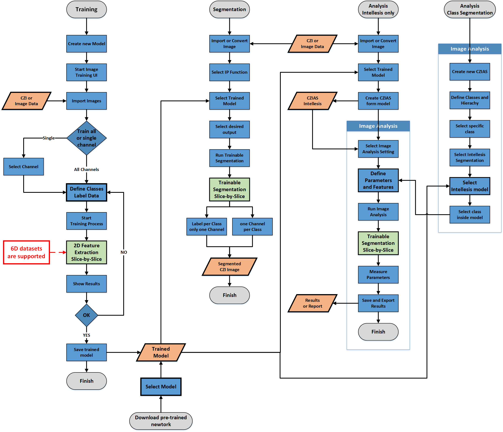
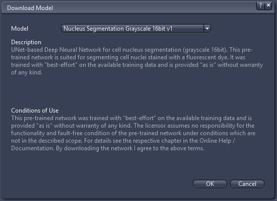
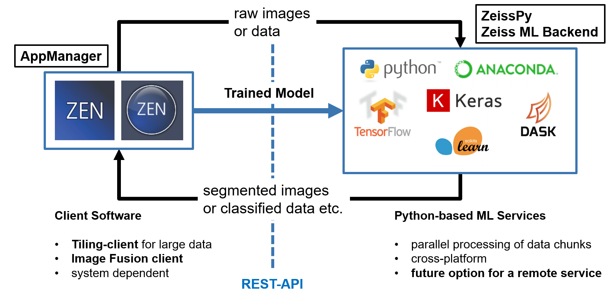

## Intellesis and Machine Learning

The ZEN software platform has various built-in image segmentation function. One of those tools is called ZEN Intellesis Trainable Segmentation, which is using machine-learning algorithms to segment images. More information can be found here:

[Intellesis Trainable Segmentation](https://www.zeiss.com/microscopy/int/website/landingpages/zen-intellesis.html)

---

---

### Key Features

- **Simple User Interface for Labelling and Training**

  - The tool aims for the non-expert by providing an “easy-to-use” interface
  - Not all “parameters” in machine-learning (an expert might expect) can be adjusted. They are hidden “on purpose”

- **Integration into ZEN Measurement Framework**

  - As segmentation is only the required first step for subsequent measurements the integration into the actual measurement tools is key

- **Support for Multi-dimensional Datasets**

  - Intellesis, especially when considering the BioFormats option, can be used to segment any image even from non-Zeiss systems. 3D stacks, Tiles, Multi-Channel, …

### Technical Specfications

- Machine-Learning Tool for Pixel Classification powered by **Python
  Dask, Scikit-Learn and Tensorflow 2**
- Real **Multi-Channel Feature Extraction** – all channels will be used to segment a pixel
- **Class Segmentation** – hierarchical structures with independent segmentation per class
- **Engineered Feature Sets** and **Deep Feature Extraction** (GPU) and pre-trained networks

  - Engineered Default Feature Sets (CPU)
    - 25 or 33 Features
  - Neural Network (vgg19) Layers for Feature Extraction (GPU)
    - 64, 128 (red. 50) or 256 (red. 70) Features for 1st, 2nd or 3rd layer

- Pixel Classification by proven and established **Random Forrest Classifier**
- Option to **download** or pre-trained DNNs for image segmentation (ZEN blue 3.1)
- Option to **Import** pre-trained DNNs for image segmentation(> ZEN blue 3.2)
  - currently 3 pre-trained networks are available
  - [PyPi package czmodel & public ANN Model Specification](https://pypi.org/project/czmodel/) to convert trained TF2 models into 'czmodel'
- Post processing by **Conditional Random Fields** (CRF)
- Option to apply **confidence thresholds**
- IP-Functions for creating masks and **scripting integration** for advanced automation
- **Client-Server Architecture** (Zen Client - Python-Server) with using REST-API
- client-side tiling & fusion functionality to deal with large **multi-dimensional data sets**
- support for Nvidia GPUs
- universal automated build pipeline for **ZeissPython** established and integrated in official Zeiss installer

### Workflows

#### Downloading Networks

ZEN Blue 3.1 release the software allows to download pre-trained networks from ZEISS. Such networks are fully integrate into the ZEN Image Analysis framework and can be used the same way as the classical Intellesis models using pixel classification

#### Importing networks

Starting with ZEN blue 3.2 it will be possible to import externally trained models into ZEN. For more details please se the [Importing External Networks](../Machine_Learning/docs/importing_external_networks_in_ZEN.md)

#### Conditions of Use

_This pre-trained network was trained with "best-effort" on the available training data and is provided "as is" without warranty of any kind. The licensor assumes no responsibility for the functionality and fault-free condition of the pre-trained network under conditions which are not in the described scope. For details see the respective chapter in the Online Help / Documentation. By downloading I agree to the above terms._

---

### Applications

ZEN can basically read any image data format using the BioFormats Import and Intellesis can therefore be used to segment **any multi-dimensional data set** that can be imported into the software. Shown below are imaged segmented using Intellesis.

_Intellesis - Material Science Applications_

---

_Intellesis - Life Science Applications_

---

### Software

The actual segmentation service is completely written in Python and is using proven and established open-source machine-learning libraries to segment the images.

To be able to handle even large multi-dimensional data sets, the software has a built-in data manager that takes care of splitting nad distributing the workload depending on the available computation resources.

---

_Intellesis - DataFlow_

---

#### APEER Integration

Due to the fact that the SegmentationService is written completely in Python is can be used a module on the APEER platform. The complete SegmenationService is running inside a Linux-based docker container.

_APEER Workflow using the Intellesis SegmentationService as a module_

---

If you want to test this platform, register here:

[APEER Platform](https://www.apeer.com/app/#/home)

To read about the newest developments on APEER read the blog:

[APEER Blog](https://www.apeer.com/app/#/home)

---

## Scripts

### ZEN_Intellesis_Simple_Test.py

This simple script demonstrated the different possibilities to segment an image using a trained model. The result of such a segmentation is a mask image, which has either as many channels as the models has classes, or one channel containing a distinct label for every class.

_(top left) - raw image data data (top right) segmented image (bottom left) segmented with confidence threshold and (bottom right) probability map image_

### Intellesis_Segmentation_Tool.py

_ZEN Intellesis Segmentation Tool_

---

The Intellesis Segmentation Tool allows you to automate and simplify the following tasks:

- Select a model to segment images
- Specify the desired output format for the mask image
- Optional Confidence Threshold that can be applied to mask image
- Optional Extraction of a specific single class
- Option to add the mask image to the original image
- Selection of output folder with file extension filter
- Option to segment all image inside a folder or only apply to active image

Beside this tool is is also possible to run a segmentation using the ZEN built-in batch tool, which does not require this script but offers less additional options.

### Intellesis_Segmentation_Tool_singleCH.py

_Intellesis Segmentation Tool Single Channel - Step 1_

---

_Intellesis Segmentation Tool Single Channel - Step 2_

---

The Intellesis Segmentation Tool Single Channel allows you to automate and simplify the following tasks:

- It uses the current active image as an input
- Specify the channel to be segmented and the model to be uses in step 1
- Specify the desired class (for the selected model) and other option in step 2
- Apply segmentation to the selected channel
- Optionally add the mask to the original multi-channel image

Beside this tool is is also possible to run a segmentation using the ZEN built-in batch tool, which does not require this script but offers less additional options.

---

_Segmented green channel (bottom left)_
